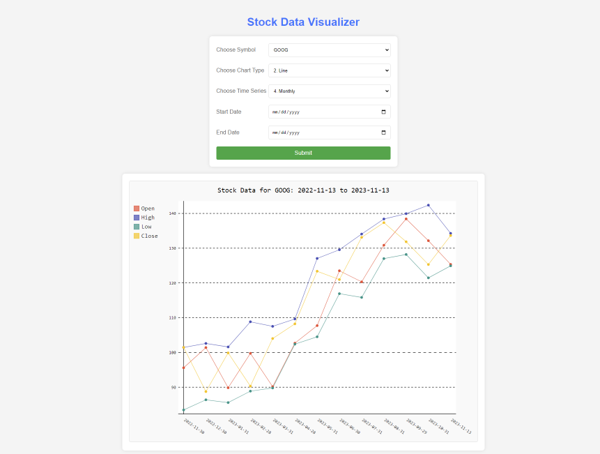

# Stock Data Visualizer - Web Version

Project 3a for INFOTC-4320-01 2023FS by Gerard Lucas

### To Install Dependencies Locally

pip install -r requirements.txt --user

### Configure API Key

an API key from [Alpha Vantage](https://www.alphavantage.co/) is required. Set your API key in app.api_key in app.py file

### Run the Application

Docker: docker-compose up -d

Local Debug: app.py is the entry point of the flask application. Debug this file.  
